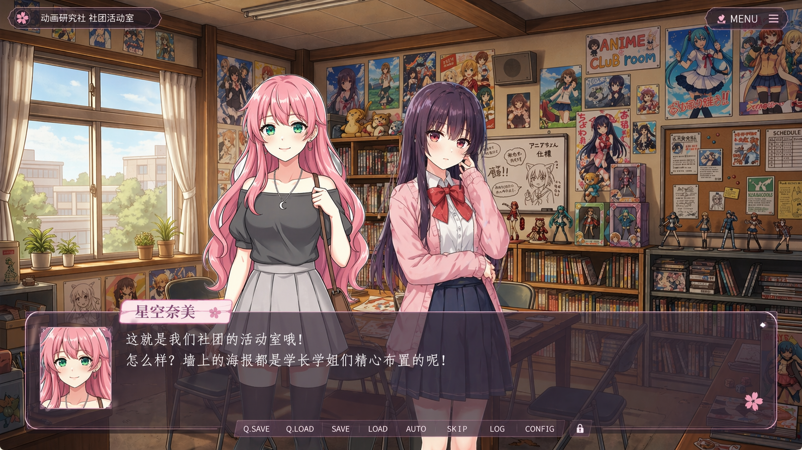
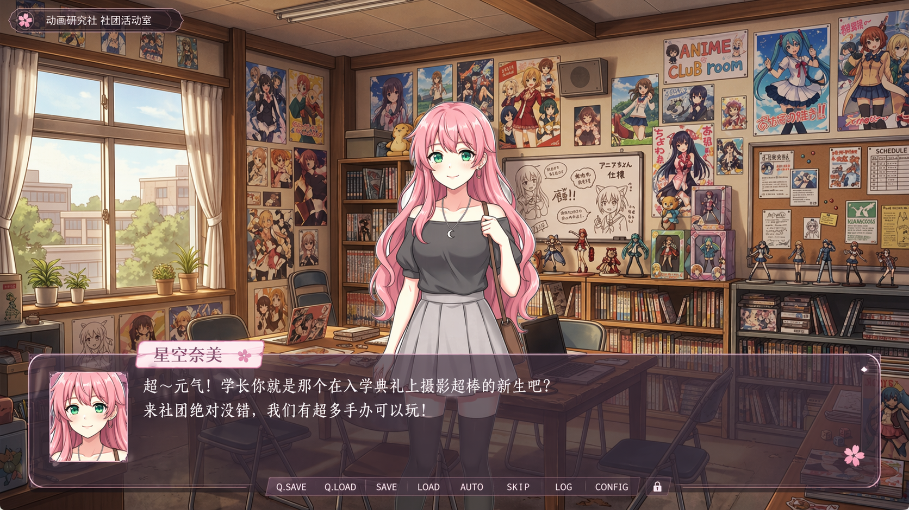
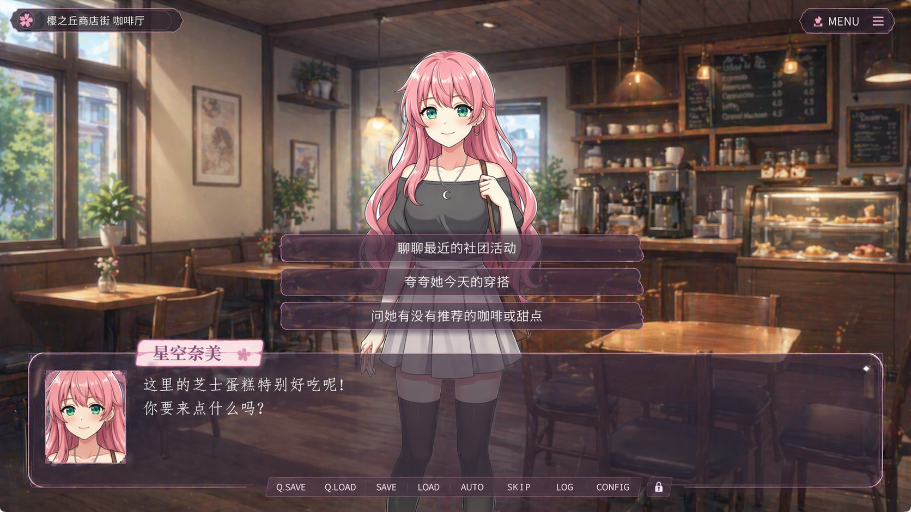
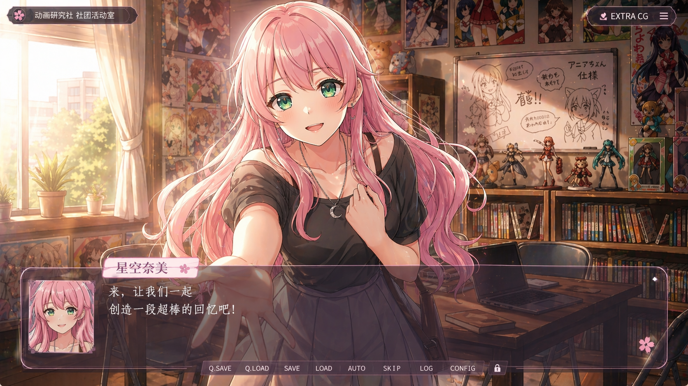

# Phantom Seed

`Phantom Seed` is an experimental game project that investigates how `Roguelike` progression can be combined with `Galgame / Visual Novel` presentation through procedural, seed-driven content generation.  
For each playthrough, the system synthesizes character profiles, narrative scenes, dialogue branches, and key visual assets, then renders them as an interactive visual-novel experience using `pygame-ce`.

## Visual Results

| Multi-character scene | Single-character scene |
| --- | --- |
|  |  |
| Branch selection | Climactic scene |
|  |  |

## Project Overview

This repository can be read as a prototype research artifact for AI-assisted narrative game generation. Its central design premise is that a compact random seed should be sufficient to produce a coherent run-level experience, including:

- a cast of heroines with distinct profiles and visual identities
- structured story scenes rather than unconstrained free-form text
- branching dialogue with route-specific progression
- generated backgrounds, portraits, and climax CGs
- persistent player state, save/load support, and scene history

Instead of treating language models as pure text emitters, the project emphasizes structured outputs and game-state-aware content generation. The resulting system is intended both as a playable prototype and as a testbed for iterative experimentation on AI-native narrative pipelines.

## Core Characteristics

- Seed-based generation produces different character constellations and narrative moods across runs.
- OpenRouter is used for structured narrative generation rather than simple free-form dialogue completion.
- The pipeline supports heroine portraits, scene backgrounds, and climactic CG generation.
- The runtime models affection, route locking, chapter progression, and ending phases.
- The interface includes save/load, quick save, quick load, backlog review, and a settings panel.
- Image caching and fallback logic are included to make repeated debugging and iteration practical.

## Gameplay Loop

1. The player starts from the main menu.
2. A new game initializes a fresh random seed.
3. The system generates multiple heroine profiles and associated portraits.
4. AI services produce the opening scene, dialogue script, choices, and principal visual assets.
5. Player choices influence global affinity and per-character route state.
6. As progression advances, the narrative transitions into route lock, climax, and ending stages.

## Technical Stack

- Python `>=3.11`
- `pygame-ce`
- `pydantic`
- `Pillow`
- `rembg[cpu]`
- `onnxruntime`
- OpenRouter Chat / Image APIs

## Installation

### 1. Install dependencies

Using `uv` is recommended:

```powershell
uv sync
```

To include development dependencies:

```powershell
uv sync --extra dev
```

### 2. Configure environment variables

Create a `.env` file in the project root:

```env
OPENROUTER_API_KEY=your_key_here
OPENROUTER_TEXT_MODEL=x-ai/grok-4.1-fast
OPENROUTER_STRUCTURED_TEXT_MODEL=x-ai/grok-4.1
OPENROUTER_DRAFT_TEXT_MODEL=google/gemini-3-flash-preview
OPENROUTER_IMAGE_MODEL=google/gemini-3.1-flash-image-preview
OPENROUTER_PROMO_IMAGE_MODEL=google/gemini-3-pro-image-preview
```

The minimum required configuration is:

```env
OPENROUTER_API_KEY=your_key_here
```

### 3. Run the project

```powershell
uv run phantom-seed
```

Alternatively, run the module entry point directly:

```powershell
uv run python -m phantom_seed.main
```

## User Controls

- `Left Click` / `Space`: advance dialogue, or immediately reveal the full line while text is typing
- `F5`: quick save
- `F9`: quick load
- `S`: open save menu
- `L`: open load menu
- `B`: open dialogue backlog
- `Right Click`: open context menu

## Runtime Configuration

At startup, the application automatically reads `.env` from the project root.  
Runtime configuration is defined in `src/phantom_seed/config.py`, including:

- window resolution: `1280 x 720`
- frame rate: `60 FPS`
- application title: `Phantom Seed`
- text speed, auto-play interval, and fullscreen settings
- OpenRouter text and image model configuration
- stronger model override support for structured scene-generation stages
- image cache directory: `.cache/images`
- save directory: `.saves`

User settings are persisted to `settings.json` in the repository root.

## Repository Structure

```text
src/phantom_seed/
├─ ai/           # LLM clients, image generation, prompts, chains, protocol definitions
├─ core/         # game state, seed logic, coordinator, roguelike rules, save system
├─ pipeline/     # asynchronous generation pipeline
├─ ui/           # pygame UI, scene rendering, menus, HUD, dialogue box, transitions
└─ main.py       # application entry point
```

## Key Modules

- `src/phantom_seed/main.py`
  - application bootstrap; validates `OPENROUTER_API_KEY` and constructs the game engine
- `src/phantom_seed/ui/engine.py`
  - main loop, event handling, scene transitions, dialogue advancement, menus, and save interactions
- `src/phantom_seed/core/coordinator.py`
  - coordinates character generation, narrative generation, image generation, state progression, and background caching
- `src/phantom_seed/ai/protocol.py`
  - defines the structured AI protocol, including entities such as `SceneData`, `CharacterProfile`, and `Choice`
- `src/phantom_seed/ai/imagen_client.py`
  - encapsulates image generation, caching, background removal, and portrait normalization

## AI Generation Pipeline

A typical new-game generation sequence is as follows:

1. Derive a hash and initial atmosphere from the current seed.
2. Generate independent heroine profiles.
3. Produce portraits for each heroine.
4. Generate the next structured narrative scene from the current game state.
5. Produce either a standard background or a climactic CG.
6. Prefetch potential transition backgrounds for upcoming scenes.

If narrative generation fails, the system falls back to a built-in fallback scene so that the play loop can continue instead of terminating completely.

## Save System

Save files are stored in `.saves/`, with each slot represented as a JSON file.  
The currently supported slots are:

- `QUICK`
- `1`
- `2`
- `3`

Each save stores more than scalar gameplay values. It also preserves:

- current route and progression step
- character data and portrait paths
- cached background references
- current scene data
- current dialogue index
- full backlog history
- thumbnail screenshots

## Research and Extension Directions

This prototype is especially suitable for future work in the following directions:

- richer route rules and ending conditions
- hybrid rendering pipelines that mix authored assets with generated assets
- character expression systems, motion variants, and costume sets
- stronger testing and developer tooling
- more explicit loading feedback and error reporting

## Development

After installing development dependencies, the following commands are available:

```powershell
uv run pytest
uv run ruff check .
```

Test coverage is not yet comprehensive and should be treated as an area for continued improvement.
