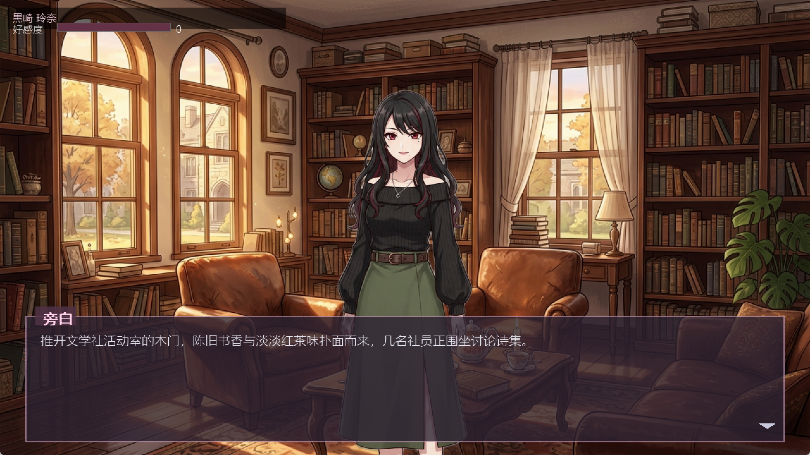
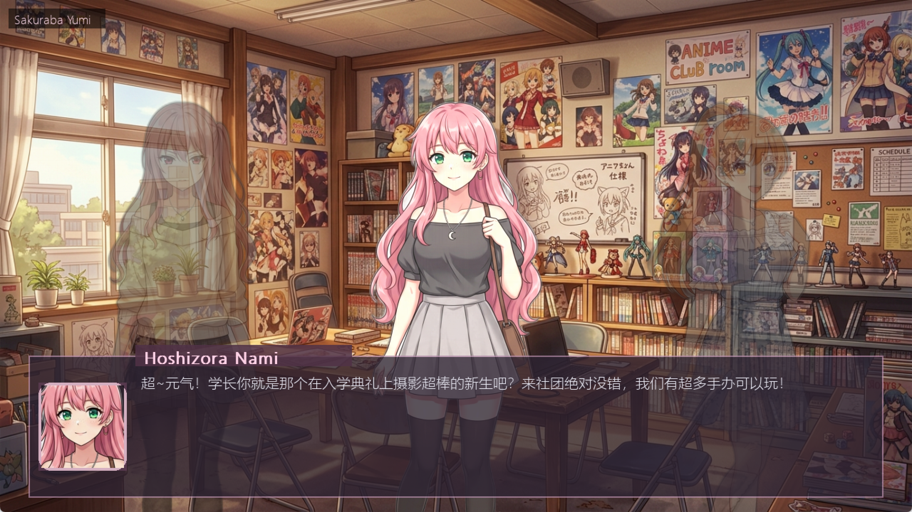

# Phantom Seed
## AIGC课程小组作业汇报答辩PPT

副标题：基于 AIGC 的 Roguelike Galgame 动态生成系统  
课程：AIGC 课程  
小组成员：`请替换为你们组员姓名`  
汇报人：`请替换`  
日期：`请替换答辩日期`

---

## 1. 项目概述

项目名称：Phantom Seed  
项目定位：一个结合 `Roguelike` 随机性、`Galgame` 叙事体验与 `AIGC` 内容生成能力的实验型游戏系统。

一句话介绍：

> 每次开局基于随机种子自动生成不同女主设定、剧情场景、对话分支和视觉素材，形成“可游玩、可分支、可重复体验”的 AI 视觉小说。

本项目不只是“让大模型写一段故事”，而是尝试把 AIGC 真正接入游戏循环，让 AI 生成结果成为玩法的一部分。

---

## 2. 选题背景与问题定义

传统视觉小说存在几个局限：

- 剧情和角色内容基本固定，重复游玩新鲜感有限
- 美术和脚本生产成本较高，内容扩展依赖人工持续投入
- 一般的 AI 文本生成作品可读性强，但可玩性弱、结构不稳定

因此我们提出的问题是：

1. 能否让 AIGC 不只负责“生成文本”，而是参与完整游戏内容生产？
2. 能否将随机种子、剧情状态和多模态生成结合，构建每局不同的可游玩体验？
3. 能否在生成式内容不稳定的前提下，通过工程方案保证游戏流程仍然可运行？

---

## 3. 项目目标

我们的目标分为三个层面：

- 产品目标：做出一个可以实际运行、可交互、可存档的 AIGC 恋爱叙事游戏 Demo
- 技术目标：实现“角色生成 + 剧情生成 + 图像生成 + 状态推进”的完整链路
- 课程目标：展示 AIGC 在多模态内容生产、结构化生成和交互式应用中的综合能力

预期效果：

- 同一套程序，多次运行可以得到不同角色阵容和剧情体验
- 玩家选择会影响好感度、线路锁定和结局走向
- 游戏拥有完整 UI，而不是仅在命令行输出一段文本

---

## 4. 核心创意

本项目的核心创意是把三个原本相对独立的方向融合在一起：

- `Roguelike`：每轮由种子驱动，带来角色与剧情的随机性
- `Galgame`：强调人物塑造、情感推进、分支选择与多结局
- `AIGC`：自动生成角色设定、场景脚本、背景图、立绘和高潮 CG

与普通 Galgame 的区别：

- 剧情不是预先全部写死，而是按当前状态动态生成
- 角色不是固定配置，而是每局自动生成多位候选女主
- 美术资源不是纯手工预制，而是运行时按描述生成并缓存

---

## 5. 系统整体方案

系统整体流程如下：

1. 玩家开始新游戏，系统生成随机种子
2. 根据种子计算氛围、特征码与角色变体
3. 调用文本模型生成多位女主的人设信息
4. 调用图像模型生成对应女主立绘
5. 结合当前状态生成结构化场景数据
6. 根据场景内容生成背景图或高潮 CG
7. 玩家进行选项选择，状态变化推动后续剧情
8. 系统在后台预取下一段内容，并支持存档/读档

一句话概括架构：

> 用结构化文本生成保证剧情可控，用图像生成增强沉浸感，用状态机保证“生成内容”能服务于“游戏体验”。

---

## 6. 技术架构

项目采用 Python 实现，主要技术栈包括：

- `pygame-ce`：负责游戏界面渲染与交互
- `pydantic`：负责约束 AI 返回的结构化数据
- `Pillow`：负责图像读取与保存
- `rembg` + `onnxruntime`：用于角色立绘抠图与透明化处理
- `OpenRouter Chat / Image API`：负责文本与图像生成

项目目录结构：

```text
src/phantom_seed/
├─ ai/        文本生成、图像生成、Prompt、协议定义
├─ core/      游戏状态、种子逻辑、协调器、存档系统
├─ pipeline/  异步预生成流程
├─ ui/        pygame 场景渲染、菜单、对话框、HUD
└─ main.py    程序入口
```

---

## 7. AIGC 关键设计一：结构化剧情生成

本项目没有直接让大模型返回自由散文，而是要求其生成结构化场景对象。

结构化字段包括：

- `scene_id`
- `background`
- `visual_type`
- `stage_commands`
- `script`
- `choices`
- `game_state_update`
- `continuity_notes`
- `open_threads`
- `next_hook`

这样做的意义：

- 便于程序解析和渲染，而不是手工从自然语言中“猜”
- 可以把剧情、舞台调度、选项和状态更新统一纳入协议
- 方便在异常情况下进行校验、修复和兜底

课程视角总结：

> 这体现了 AIGC 从“内容生成”走向“可执行生成”的思路。

---

## 8. AIGC 关键设计二：多模态生成链路

项目中的多模态生成分为三类：

- 角色立绘生成：根据角色外观描述生成单人立绘
- 场景背景生成：根据场景描述生成环境背景
- 高潮 CG 生成：在关键剧情节点生成更强表现力的画面

对应策略：

- 角色图生成后进行抠图、主体提取和统一画布标准化
- 背景图按描述缓存，避免重复生成
- 关键 CG 可参考已有角色和背景素材，增强一致性

这解决了两个常见问题：

- AI 图像生成结果风格不统一
- 重复生成带来等待时间长、成本高的问题

---

## 9. 游戏机制设计

为了让生成内容真正“可玩”，我们设计了状态推进机制：

- 总好感度
- 各女主独立好感度
- 共通线 / 锁线窗口 / 个人线 / 高潮 / 结局阶段
- 历史摘要与长期记忆碎片
- 伏笔、地点、线路钩子等连续性信息

主要逻辑：

- 前期为共通线，逐步塑造多位角色
- 中期进入锁线窗口，玩家选择明显影响路线归属
- 后期进入某位女主个人线，并生成对应高潮与结局

这意味着：

> 项目不是随机拼接故事，而是在“叙事状态机”约束下进行生成。

---

## 10. 工程实现亮点

为了提升系统可用性，我们加入了多项工程化设计：

- 并行生成多位女主人设与立绘，缩短初始化等待时间
- 异步预取下一场景，提升交互流畅度
- 图片缓存机制，减少重复生成与 API 开销
- fallback scene 兜底，避免模型异常导致游戏中断
- 存档 / 读档 / 快速存档 / backlog 回看
- 缩略图存档信息，增强演示完整度

可以强调的课程价值：

- 这不是一个“只会调用 API”的 Demo
- 而是一个考虑了性能、异常、状态恢复和用户体验的完整应用原型

---

## 11. 演示效果展示

建议本页放运行截图，突出“生成内容已经进入真实游戏界面”。

展示图 1：单角色剧情场景  
图片路径：`screenshot/1.png`

展示要点：

- 自动生成背景与立绘
- 左上角显示角色名与好感度
- 下方对话框呈现 AI 生成剧情文本



---

## 12. 演示效果展示（二）

展示图 2：多角色舞台表现  
图片路径：`screenshot/image.png`

展示要点：

- 支持多角色同场景展示
- 可根据剧情进行角色入场、离场和站位切换
- 界面风格接近传统视觉小说，而非普通聊天界面



---

## 13. 本项目的创新点

我们认为本项目的创新点主要体现在四个方面：

1. 将 `Roguelike` 随机种子机制引入 `Galgame` 叙事生成
2. 将 AIGC 从单次内容生成扩展为“持续参与游戏循环”的系统能力
3. 通过结构化协议把大模型输出转化为可执行游戏脚本
4. 将文本生成、图像生成、状态机与 UI 渲染整合为统一应用

如果老师问“创新性在哪里”，可以直接回答：

> 创新不在单一模型调用，而在于把 AIGC 变成一个面向交互式应用的内容生产引擎。

---

## 14. 项目价值与课程收获

本项目的课程价值体现在：

- 展示了 AIGC 在游戏、互动叙事和数字内容生产中的应用潜力
- 体现了 Prompt 设计、结构化输出、多模态协同和工程落地能力
- 说明仅有模型能力还不够，必须结合状态管理和软件工程才能形成 usable system

我们在项目中获得的能力：

- 学会将大模型输出约束为可验证的数据结构
- 学会处理图像生成与本地资源管理
- 学会从“生成一个结果”转向“设计一个生成系统”

---

## 15. 存在的问题与不足

目前项目仍存在一些不足：

- 图像风格一致性仍然受模型随机性影响
- 剧情质量会受模型波动与上下文长度限制影响
- 角色长期记忆和复杂世界观仍不够稳定
- 测试覆盖和自动评估体系还不完善
- 实时生成会带来一定等待时间和 API 成本

这部分建议答辩时主动承认，因为会显得更真实、更专业。

---

## 16. 后续优化方向

后续我们计划从四个方向继续优化：

1. 增强人物一致性  
通过更强的角色设定约束、参考图机制与风格控制，提高视觉连续性

2. 优化剧情质量  
引入更细的剧情规划、记忆检索和多阶段生成，提高故事稳定性

3. 提升交互体验  
增加表情、动作、音效、加载进度和更多 UI 动效

4. 建立评测体系  
从可玩性、一致性、延迟和用户满意度等维度进行量化分析

---

## 17. 总结

本项目完成了一个可运行的 AIGC 恋爱叙事游戏原型，验证了以下结论：

- AIGC 可以不止用于“生成文本”，也可以成为交互系统中的内容引擎
- 结构化生成是将大模型应用到游戏中的关键桥梁
- 多模态生成与状态机结合后，可以形成更强的沉浸感和可玩性
- 工程化兜底机制对于 AIGC 应用落地非常重要

最终结论：

> Phantom Seed 证明了 AIGC 在互动叙事游戏中的可行性，也展示了从模型调用走向系统设计的实践路径。

---

## 18. 致谢

感谢老师与同学们聆听。  
欢迎提出问题与建议。

---

## 附录：答辩时可直接使用的话术

### 1. 项目一句话介绍

我们做的是一个基于 AIGC 的动态 Galgame 系统。与传统视觉小说不同，它不是把固定剧本换成 AI 文本，而是把角色设定、剧情脚本、背景、立绘和分支推进都接入了生成链路，所以每一局体验都会不同。

### 2. 为什么这个项目适合 AIGC 课程

因为它同时涉及文本生成、图像生成、结构化输出、多模态协同和工程落地，不是单一模型实验，而是完整应用场景。

### 3. 最想强调的技术点

最重要的不是“我们调用了模型”，而是“我们让模型输出可以被程序可靠执行”。也就是通过 pydantic 协议约束，把剧情生成变成结构化场景生成。

### 4. 如果老师问难点是什么

最大的难点是生成内容天然不稳定，但游戏流程必须稳定。所以我们加入了协议校验、fallback 场景、缓存、异步预取和状态管理，尽量把不稳定模型包装成可运行系统。

### 5. 如果老师问创新点是什么

创新点是把 Roguelike 的随机性、Galgame 的叙事体验和 AIGC 的多模态生成结合起来，让 AI 不只是写内容，而是真正参与游戏机制。

### 6. 如果老师问还有哪些不足

目前最明显的不足是图像风格一致性和长剧情稳定性还不够，后续会继续优化记忆机制、参考图生成和自动评测。
